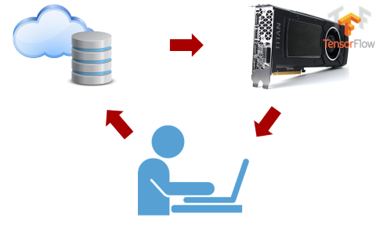
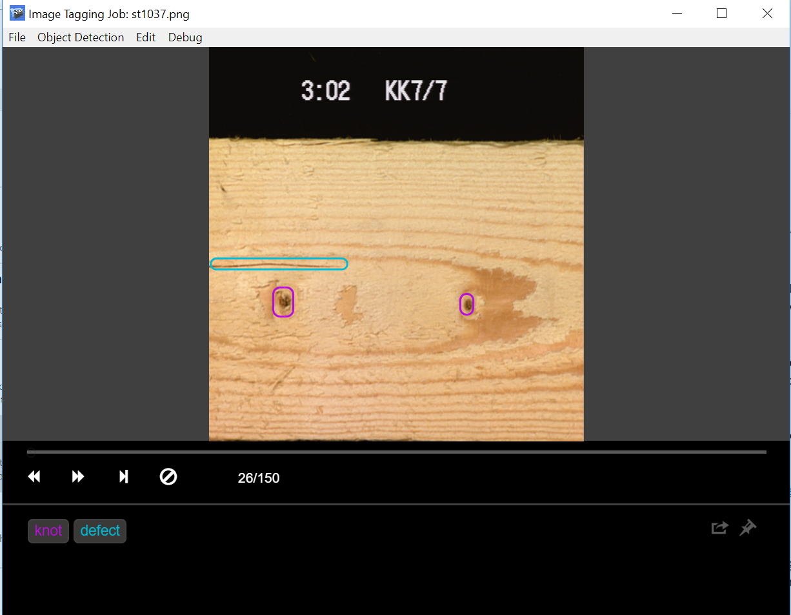

# Active learning + object detection
Labeling images for object detection is commonly required task to get started with Computer Vision related project.
Good news that you do not have to label all images  (draw bounding boxes) from scratch --- the goal of this project is to add (semi)automation to the process.
We will use Transfer Learning and Active Learning as core Machine Learning  components of the pipeline.
 -- Transfer Learning: use powerful pre-trained on big dataset (COCO) model as a startining point for fine-tuning foe needed classes.
 -- Active Learning: human annotator labels small set of images (set1), trains Object Detection Model  (model1) on this set1 and then uses model1 to predict bounding boxes on images (thus pre-labeling those). Human annotator reviews mode1's predictions where the model was less confident -- and thus comes up with new set of images -- set2. Next phase will be to train more powerful model2 on bigger train set that includes set1 and set2 and use model2 prediction results as draft of labeled set3…
The plan is to have 2 versions of pipeline set-up.

# Semi-automated pipeline

  

This one (ideally) includes minimum setup. The core components here are: 
1) Azure Blob Storage with images to be labeled.
It will also be used to save "progress" logs of labeling activities
2) "Tagger" machine(s) 
This is computer(s) that human annotator(s) is using as environment for labeling portion of images -- for example [VOTT](https://github.com/Microsoft/VoTT).  
Here example of labeling flow in VOTT: I've labled wood "knots" (round shapes) and "defect" (pretty much  non-round shaped type of defect):

3) Model re-training machine (or service)
This is environment were Object Detection model is retrained with growing train set as well as does predictions of bounding boxes on unlabeled images.
There is config.ini that needs to be updated with details like blob storage connection  and model retraining configuration. 

# Automated pipeline
More details TBD.  
Basically the idea is to kick off Active Learning cycle with model retaining as soon as human annotator revises new set of images.

# How to run semi-automated pipeline
The flow below assumes the following: 
1) We use Tensorflow Object Detection API (Faster RCNN with Resnet 50 as default option)  to fine tune object detection. 
2) Tensorflow Object Detection API is setup on Linux box (Azure DSVM is an option) that you can ssh to. See docs for Tensorflow Object Detection API regarding its general config.
3) Data(images) is in Azure blob storage
4) Human annotators use [VOTT](https://github.com/Microsoft/VoTT)  to label\revise images.  To support another tagging tool it's output (boudin boxes) need to be converted to csv form -- pull requests are welcomed!

Here is general flow has 2 steps:
1) Environments setup
2) Active Learnining cycle: labeling data and running scipts to update model and feed back results for human annotator to review.  
The whole flow is currenly automated with **4 scrips** user needs to run.

### General  prep
1) Provision Azure Blob storage. Create 2 containers: _"activelearningimages"_ and _"activelearninglabels"_
2) Upload unzipped folder with images to  _"activelearningimages"_ container.

### On Linux box aka Model (re)training env
1) Setup Tensorflow Object Detection API if you have not already.
This will include cloning of https://github.com/tensorflow/models. (On my machine I have it cloned to `/home/olgali/repos/models`).
 Run `research/object_detection/object_detection_tutorial.ipynb` to make sure Tensorflow Object Detection API is functioning.
2) Clone this repo to the machine (for example: `/home/olgali/repos/models/research/active-learning-detect/`)
3)  Update _config.ini_: 
  - set values for _AZURE_STORAGE_ACCOUNT_ and _AZURE_STORAGE_KEY_
  - set (update if needed) values for _# Data Information_ section
 -  set values for _# Training Machine_ and _# Tensorflow_ sections of the config.ini  
 _"python_file_directory"_ config value should point to the _"train"_ scripts from this project.
Example:  
`python_file_directory=/home/olgali/repos/models/research/active-learning-detect/train`
3) pip install azure-blob packages: azure.storage.blob

### Tagger machine(s) (could be same as Linux box or separate boxes\vms)
1) Have Python 3.6 up and running.
2) Pip install azure-blob packages: azure.storage.blob
3) Clone this repo, copy  updated config.ini from Model re-training box (as it has Azure Blob Storage and other generic info already).
4) Update  _config.ini_ values for _# Tagger Machine_ section:    
        `tagging_location=D:\temp\NewTag`
        
# Label data, run the scripts!
Overview: you will run **4 scripts* in total: 
- two scipts on the machine where model (re)training happens and 
- two scripts where human annotators label images (or review images pre-labeled by the model).

### On Linux box aka Model (re)training env
Run bash script to Init pipeline  
`~/repos/models/research/active-learning-detect/train$ . ./active_learning_initialize.sh  ../config.ini`
This step will:
- Download all images to the box.
- Create totag_xyz.csv on the blob storage ( "activelearninglabels" container by default).  
This is the snapshot of images file names that need tagging (labeling).  As human annotators make progress on labeling data the list will get smaller and smaller.

### Tagger machine(s)
1) Make sure that the tagging_location is empty.
2) Start each "phase" with downloading images to label (or to review pre-labeled images).  
Sample cmd below requests 40 images for tagging:  
`D:\repo\active-learning-detect\tag>python download_vott_json.py 40 ..\config.ini`  
This step will create new version of totag_xyz.csv on blob storage that will have 40 images excluded from the list.  
File tagging_abc.csv will hold list of 40 images being tagged.
3) Start [VOTT](https://github.com/Microsoft/VoTT) , load the folder for labeling\review (in my case it will be `D:\temp\NewTag\images`)
4) Once done with labeling push results back to central storage:  
 `D:\repo\active-learning-detect\tag>python upload_vott_json.py ..\config.ini`
This step will push tagged_123.csv to blob storage: this file contains actual bounding boxes coordinates for every image.  
Tagging_abc.csv will contain list of files that are "work in progress" -- the ones to be tagged soon.

  
Now model can be trained.

### Model(re)training on Linux box
Before your first time running the model, and at any later time if you would like to repartition the test set, run:

`~/repos/models/research/active-learning-detect/train$ . ./repartition_test_set_script.sh  ../config.ini`

This script will take all the tagged data and split some of it into a test set, which will not be trained/validated on and will then be use by evalution code to return mAP values.

Run bash script:  
`~/repos/models/research/active-learning-detect/train$ . ./active_learning_train.sh  ../config.ini`

This script will kick of training based on available labeled data.  

Model will evaluated on test set and perf numbers will be saved in blob storage (performance.csv).

Latest totag.csv will have predictions for all available images made of the newly trained model -- bounding box locations that could be used by human annotator as a starter.

### Reviewing of pre-labeled results (on Tagger machine)
Human annotator(s) deletes any leftovers from previous predictions (csv files in active-learning-detect\tag, image dirs) and runs goes again sequence of:
1) Downloading next batch of pre-labeled images for review (`active-learning-detect\tag\download_vott_json.py`)
2) Going through the pre-labeled images with [VOTT](https://github.com/Microsoft/VoTT)  and fixing bounding boxes when needed.
3) Pushing back new set of labeled images to storage (`active-learning-detect\tag\upload_vott_json.py`) 

Training cycle can now be repeated on bigger training set and dataset with higher quality of pre-labeled bounding boxes could be obtained. 

# Using Custom Vision service for training

The Custom Vision service can be used instead of Tensorflow in case you do not have access to an Azure Data Science VM or other GPU-enabled machine. The steps for Custom Vision are pretty similar to those for Tensorflow, although the training step is slightly different:

### Model (re)training on Custom Vision
If you would like to repartition the test set, run:

`~/repos/models/research/active-learning-detect/train$ . ./repartition_test_set_script.sh  ../config.ini`

This script will take all the tagged data and split some of it into a test set, which will not be trained/validated on and will then be use by evalution code to return mAP values.

To train the model:  
python cv_train.py ../config.ini

This python script will train a custom vision model based on available labeled data.  

Model will evaluated on test set and perf numbers will be saved in blob storage (performance.csv).

Latest totag.csv will have predictions for all available images made of the newly trained model -- bounding box locations that could be used by human annotator as a starter.

# Sample dataset
I'm using wood knots dataset mentioned in this [blog](http://blog.revolutionanalytics.com/2017/09/wood-knots.html) 
Here is [link](https://olgaliakrepo.blob.core.windows.net/woodknots/board_images_png.zip) to the dataset: zip file with 800+ board png images.
 
# Custom Vision HttpOperationError 'Bad Request'

The current custom vision SDK is in preview mode, and one of the limitations is that an error while training does not return an error message, just a generic 'Bad Request' response. Common reasons for this error include:
1) Having a tag with less than 15 images. Custom Vision requires a minimum of 15 images per tag and will throw an error if it finds any tag with less than that many.
2) Having a tag out of bounds. If for some reason you attempt to add a tag through the API which is out of bounds, it will accept the request but will throw an error while training.
3) No new images since last training session. If you try to train without adding additional images Custom Vision will return a bad request exception.
The best way to debug these is to go into the Custom Vision website (customvision.ai) and click the train button, which should then tell you what the error was.
