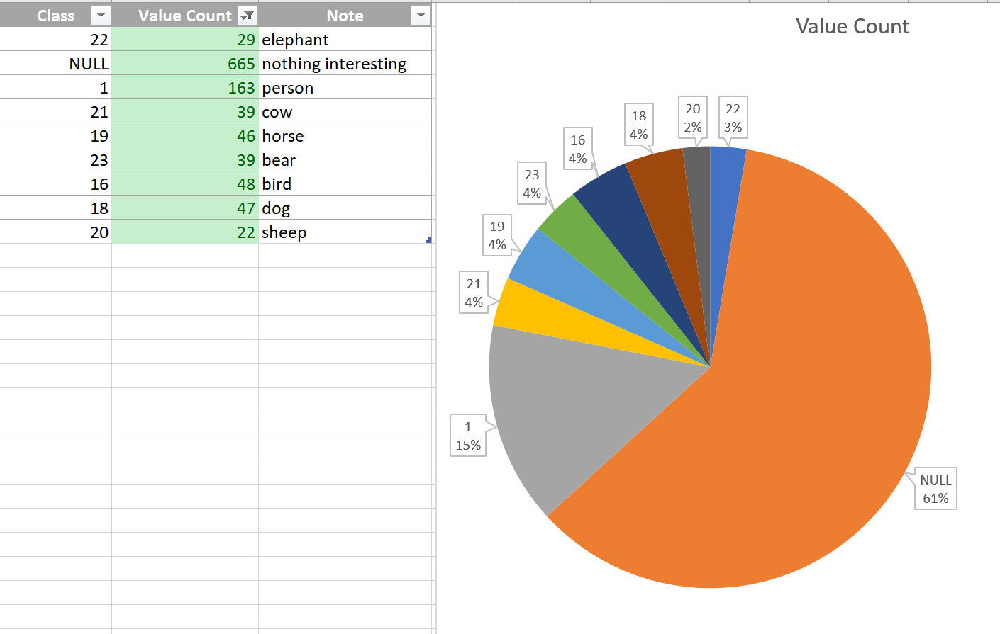
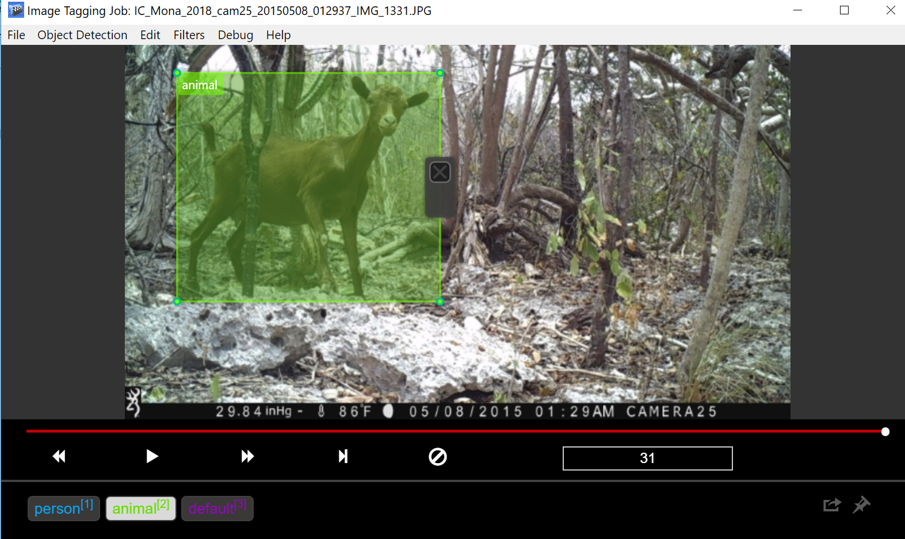

# Guide to "initialization" predictions
Assuming you got an datatet containing  many thousands of images -- how do you get started with labeling first
few hundreds images? 
What about unblanced case when most of the pictures not have much going on?  
If you just random sample pictures _blindly_ it make quite a few Active Learning cycles to set your model and 
training set onto the right pass.

## Let's get "metadata" about each image
We could use pretrained model that can detect decently few dozens or more object class to get idea what kind
of objects are on the images. The model might not provide super-accurate results however some of those might be
useful for more target image sampling.  
For example if you dataset has common scenes of nature or city life than using model trained on [COCO dataset](https://github.com/amikelive/coco-labels/blob/master/coco-labels-paper.txt)
might give you an idea what images have objects that _resembles_ person, car, deer and so on. And depedning on your
scenario you might focus you initial labeling efforts on images that have or don't have a particular class.  

  

## Settings in config.ini
The following settings control what model is going to be used for "initialization" predictions.  
  - init_model_name=faster_rcnn_resnet101_coco_2018_01_28  
  Model name to be used for predictions. Current code assumes it's COCO based model.
  - init_pred_tf_url=http://download.tensorflow.org/models/object_detection/${init_model_name}.tar.gz  
 URL for downloading model from Tensorflow Object Detection model zoo.  
  - init_model_graph=${download_location}/${init_model_name}/frozen_inference_graph.pb 
  Location (on DSVM) of inference graph that's used for producing "initialization" predictions. 

## Running "initialization" predictions flow
Once config settings are set (and images are on blob storage) user needs to do the following:
- SSH to DSVM and run script  that will actually produces predictions
- provide desired mapping (and merging) or detected classes to the classes of interest (more details below)
- dowload specified number of images to client machine and review the tags

*Produce predictions*  
SSH to DSVM, activate needed Tensorflow virtul environment if needed and run:  
 `. ./active_learning_init_pred.sh ../config.ini`  
 The output _init_totag*.csv_ contains all detecting objetcs bboxes iformation. It's probably worth spedining
 the time analizing those results. 
  
 *Class mapping json*  
 Please refer to _sample_init_classes_map.json_ for reference. 
 First we define that we want to class  "1" to be shown as class "person" in VOTT when user will be doing labels review.
 We also want to have 60% of images that will be pulled for review to have presence of class "person" in them:  
 `{`  
      `"initclass": "1", `       
     `"map": "person",`  
     `"balance": "0.6"`  
  `}`
  
 Then we want to _merge_ several classes: "19" (horse) and "21" (cow) will be displayed in VOTT as "animal".  
    `{`  
      `"initclass": "19",`  
      `"map": "animal",`  
      `"balance": "0.2"`  
    `},`  
    `{`  
      `"initclass": "21",`  
      `"map": "animal",`  
      `"balance": "0.2"`  
    `}'  
    
  We specify that 20% of each _animal_ class (40% in total) is present in the dataset that user will be reviewing in VOTT.  
   Also we specifically request not to include images where no known COCO classes were detected. Given that COCO-based
    model may miss quite a bit of objects it's good practice still to review some of those.  
  Model might be detecting classes that we will be cluttering image during review process. For example the dataset
  may have busket images that is wrongly classified as a "vase".  In scenario when we are not interested in detecting
  baskets nor vases we may want just to "drop" bboxes for the "vase" class (class 86 in COCO):  
  ` "unmapclass":["64","86", "15"],`   
  Finally for _everything else_  -- classes we are not sure what to do at this stage but still want to preserve bbox -- 
  we will map then to a "default" class. We can set the name of "default" class in mapping json.
  
  *Review predictions in VOTT* 
  On a client (tagger) machine run the usual script to download images. Only difference is that you'd be providing 
  "class mapping json" as 3rd parameter:  
  ` D:\repo\active-learning-detect\tag>python download_vott_json.py 200 ..\config.ini ..\sample_init_classes_map.json`  
  
    